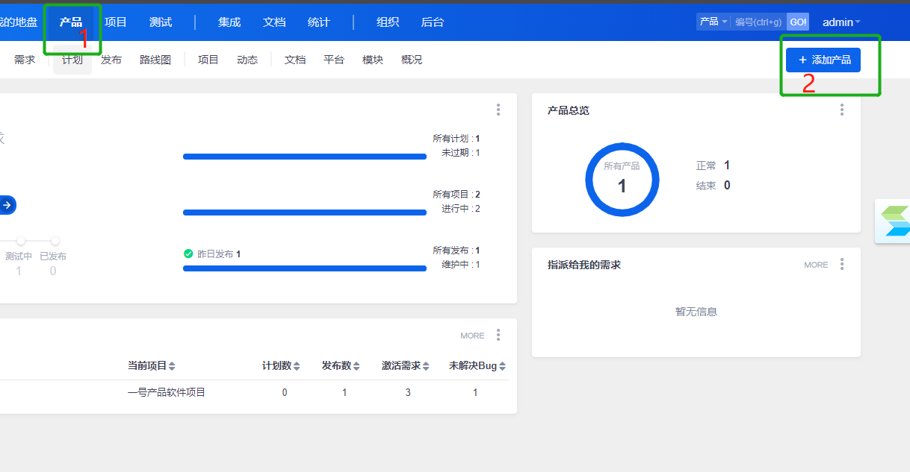
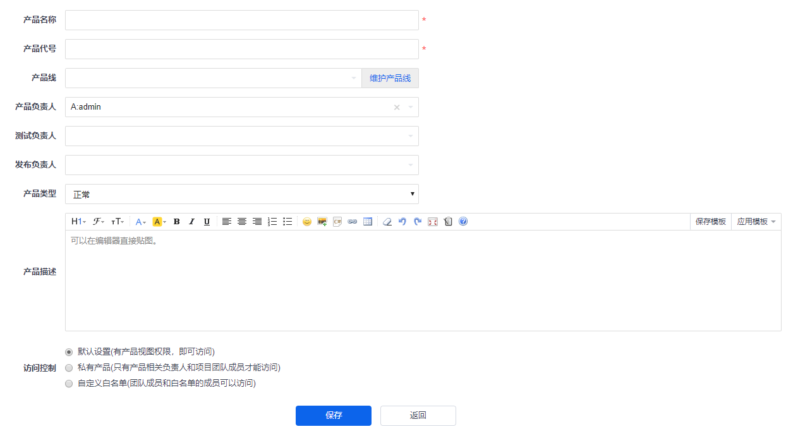
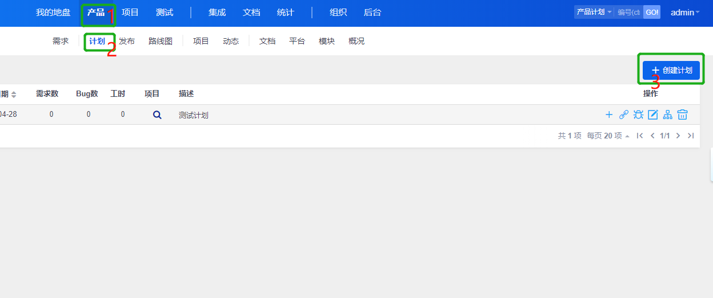
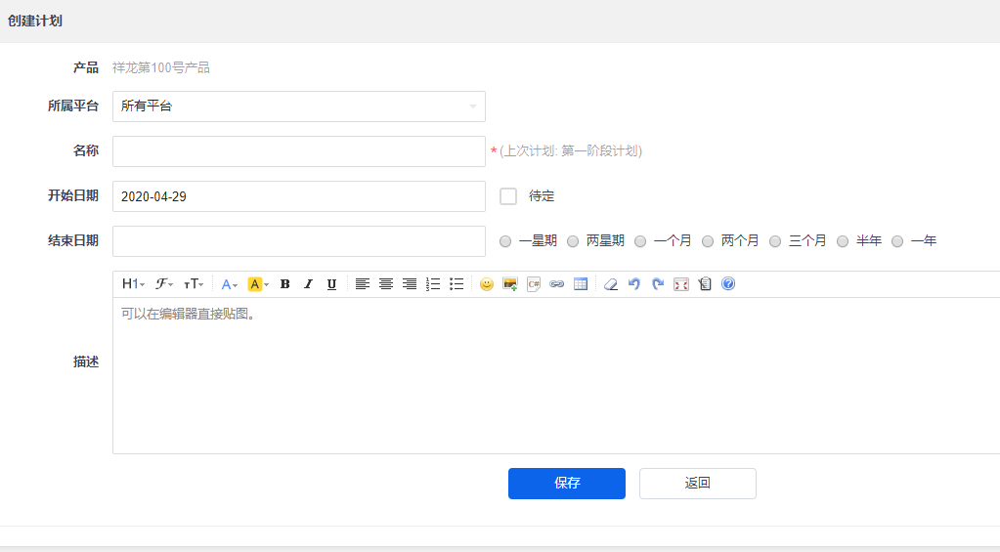
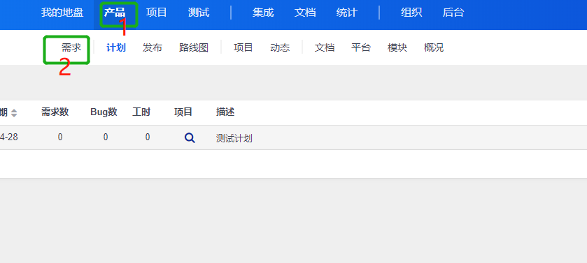
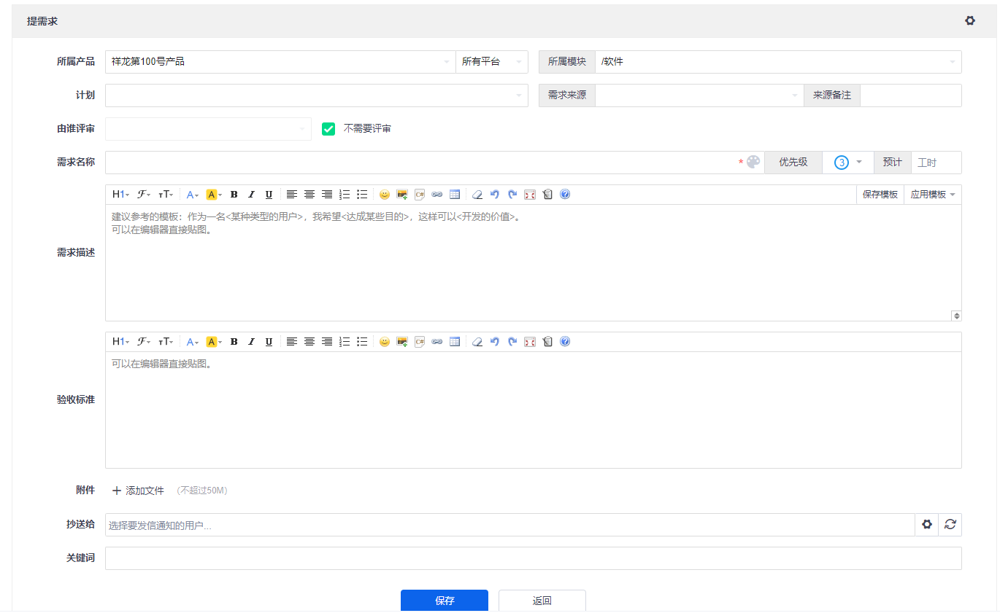
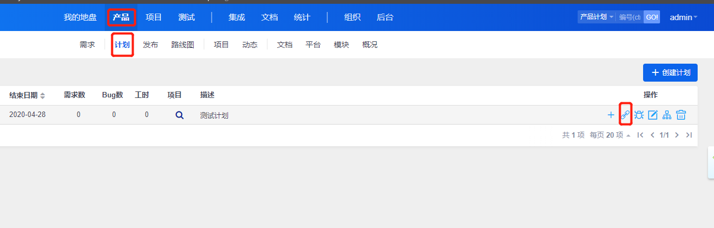
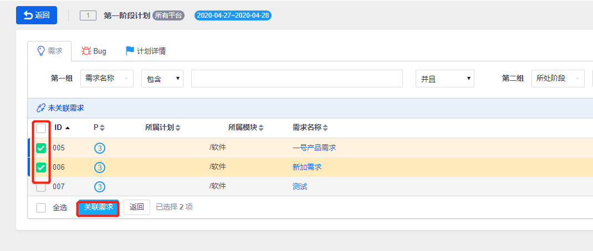
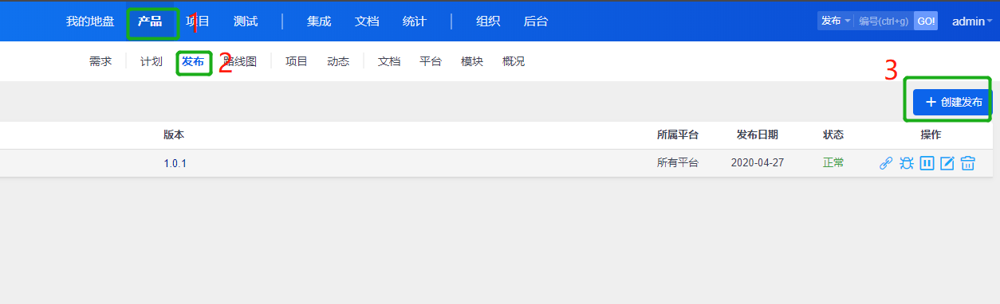

# 产品经理操作手册
## 产品经理禅道主要操作流程
1. 建立产品=>创建计划=>需求录入=>关联需求到计划=>
2. 发布产品=>
3. 创建任务=>
4. 领取任务

## 1.建立产品

.在下图页面添加产品即可

## 2.创建产品计划

.下图创建计划

## 3.需求录入

.以下为需求添加页面

## 4.关联需求到计划

## 5.发布产品

## 6.创建任务

## 7.领取任务

