# 测试人员操作手册
## 测试人员禅道主要操作流程
1. 领取任务=>新增bug=>提交bug=>验证bug=>关闭bug
2. 创建测试用例=>执行测试用例=>更新测试用例问题=>补充测试用例
3. 建测试报告

## 领取任务
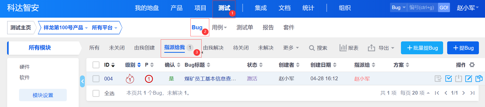

## 新增bug
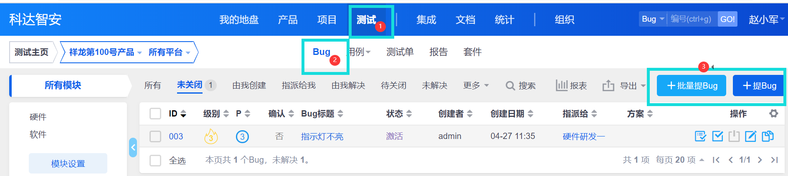

## 提交bug
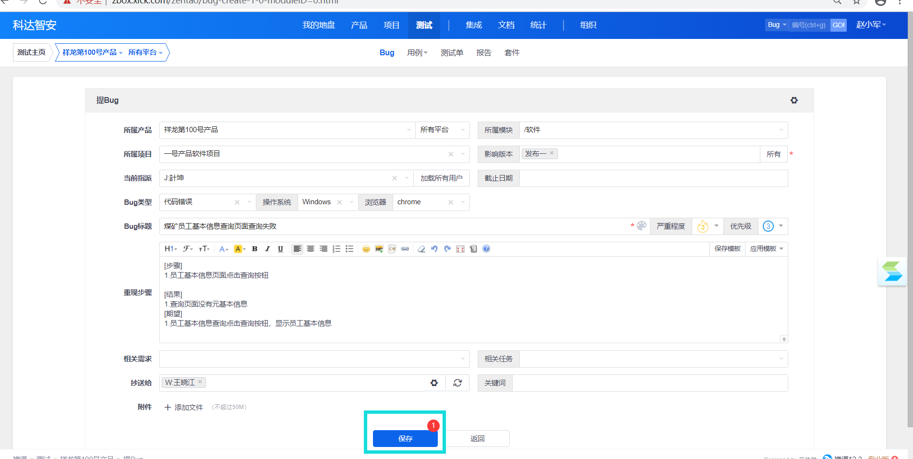

## 验证bug
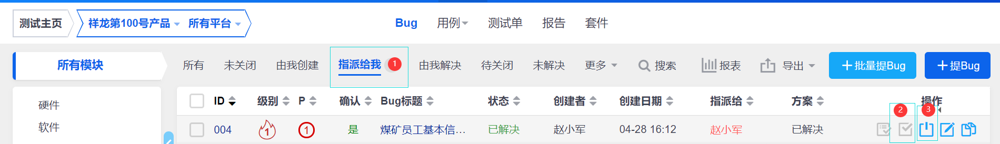

## 关闭bug
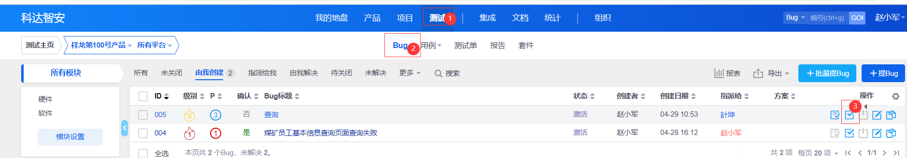
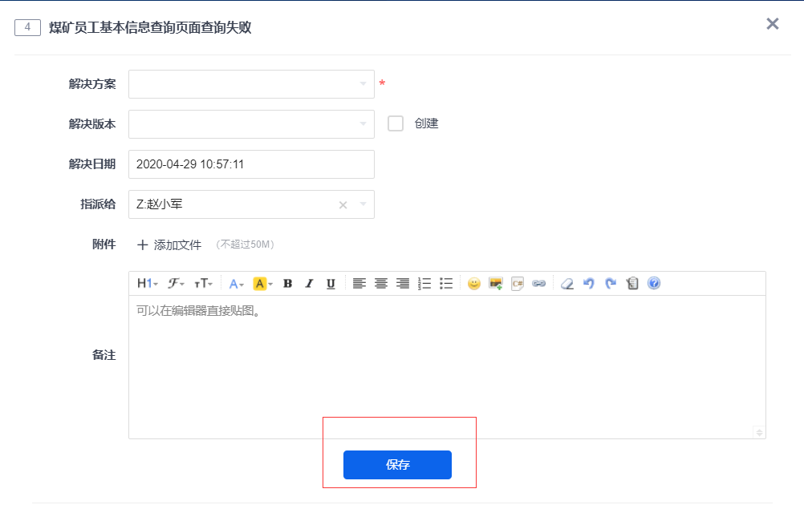
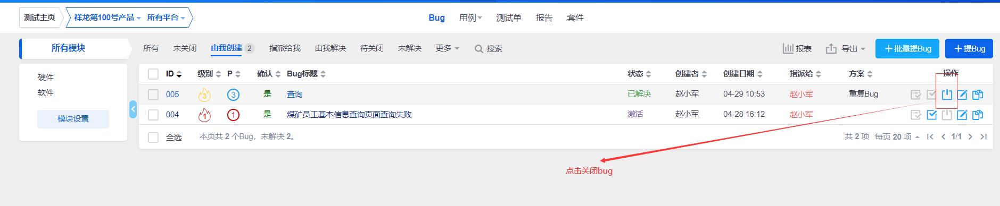

## 创建测试用例
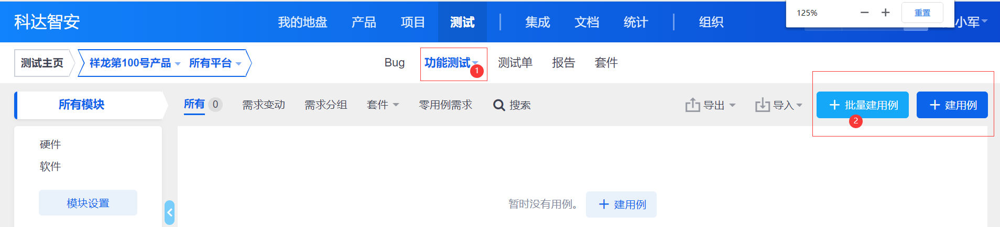

## 提交测试用例
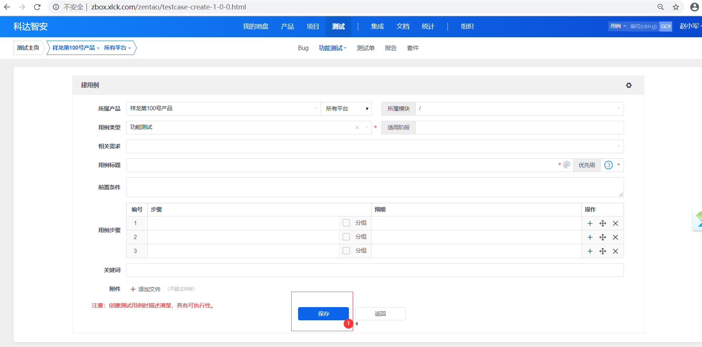

## 执行测试用例
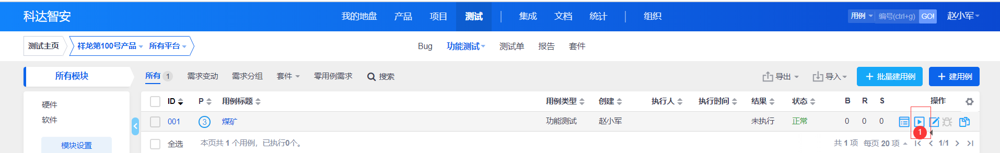

## 提交执行测试用例
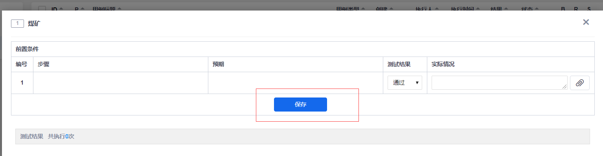

## 更新测验用例
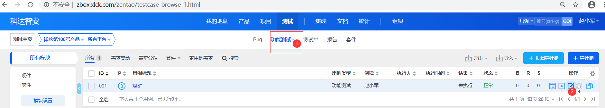

## 创建测试报告
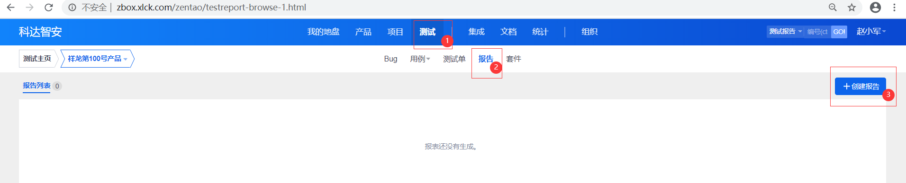

## 提交测试报告
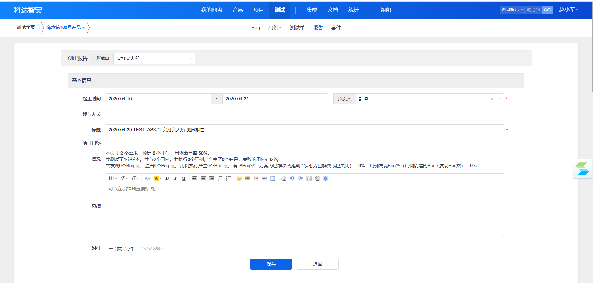
