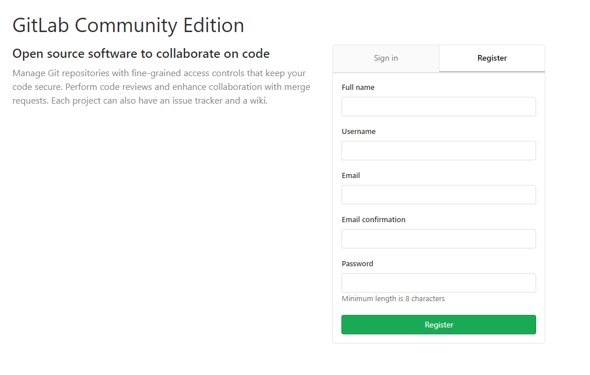

## 用户

### 添加用户

* 用户可以自己注册
  

* 管理员可以主动添加用户，用户会收到邮件通知，并重置密码
  <iframe height=450 width=700 src="./../../video/gitlab/newuser.mp4" frameborder=0 allowfullscreen></iframe>

  用户收到邮件：

  

  点击链接，重置密码，即可登录。

### 用户上传自己的SSH Key

记事本打开`C:\Users\Harris Wang\.ssh\id_rsa.pub`文件，内容如下：

```shell
ssh-rsa AAAAB3NzaC1yc2EAAAADAQABAAABAQDFzwHVHv/8225rhNwSE2iAHUjAQD6YOChBbkOOVRhH3/d/M9YKr5mcvLTwIQ5koaK1s7w8mPeHYSf2ql/goloZxCQj/uOfSK25h2i8oSU1lzGSSzno8yDKsy20WgdOKHdRsfvwY8RjkQ5bt9ZBRRl1PwGz+nU+JOF0WpHtk20lzXZmA8pXlcwK6a+2tRo79Atacfmp4UN/9w9k5rVUKhmOQVYofcY4fK0tAcVDvX4p6inWGlLPkmQmQh3U7zHZy0n4CFbs3ejrTXZFmpzmgGWaxX+hPlbR07chNWfzz2IMtruTxKlzNSf5iGOcnXesL8PV8PPu+6DH9239iseOmT1Z harris-wang@qq.com
```

复制内容，粘贴到gitlab中：

<iframe height=450 width=700 src="./../../video/gitlab/publickey.mp4" frameborder=0 allowfullscreen></iframe>

如果没有.ssh文件夹，或者.ssh文件夹里没有内容，请参考[git安装](./../sourcetree/install.md)。