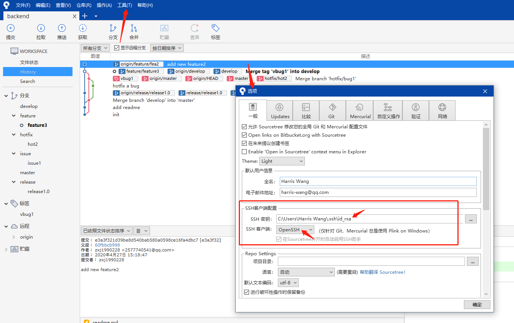

## 安装

### 安装git

去[https://git-scm.com/](https://git-scm.com/)下载git安装包，默认安装即可。


### 配置git

打开`git bash`，输入以下命令，配置自己的用户名和邮箱地址：

```shell
git config --global user.name "username"
```

```shell
git config --global user.email "email"
```

输入以下命令产生自己的密钥对：

```shell
ssh-keygen -t rsa -C "your email"
```
按三次回车键即可。

登录gitlab，上传自己的公钥，参考[Gitlab 用户](./../gitlab/user.md)。


### 安装Sourcetree

1. 去[https://www.sourcetreeapp.com/](https://www.sourcetreeapp.com/)下载安装包。
2. 安装过程中选择Bitbucket，注册Bitbucket账号授权安装。
3. 不要选择mercurial，下载会很慢。


### 配置Sourcetree



